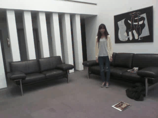
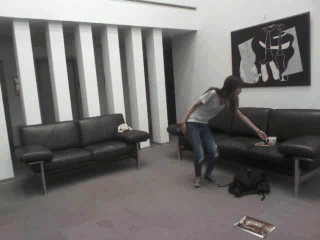
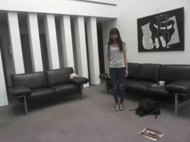

# CITI-DailyActivities 3D dataset
**Code Author: Shih-Yao (Mike) Lin**

The CITI-DailyActivities 3D dataset comprises action videos of three modalities such as RGB videos, depth maps, and 3D skeleton structures. It contains fifteen daily activities including walk, sit down, sit still, use a TV remote, stand up, stand still, pick up books, carry books, put down books, carry a backpack, drop a backpack, make a phone call, drink water, wave hand, and clap.

The dataset has 481 sequences. Among them, 182 sequences contain outlier frames presenting in arbitrary locations and lasting for various durations. Ten actors, including eight males and two females, were recruited for building this dataset, and one of them is left-handed. Each activity is performed by each actor between two and five times. A Microsoft Kinect was used for the collection so that the RGB video, the depth maps, and the inferred skeletons of each activity sequence are all available. The skeleton structures in this work were extracted by using the Kinect SDK v1.8









## Download data
1. [RGB Images](https://drive.google.com/open?id=1wjtMKBEd02muTAMZD9vSLsSj9M2i3qqn) (480x640) 
2. [Depth Images](https://drive.google.com/open?id=1WnYZHO3406oIDcZl-KxYXBhQNSOELd2W)
3. [Skeletal Data](https://drive.google.com/open?id=1IdVBAxKqQqx4yz2ctdEn9dc1YwzNLPnF) (320x240)
4. [Labels](https://drive.google.com/open?id=1aUF_oRhJNb6prBGJ6mhkz-3NJcmbsMRJ)

NOTE: The dataset contains 481 action examples, where action example #1 - #300 are the actions without outlier frames, and action example # 301 - # 482 are the actions with outlier frames. 

## Load skeleton data
```
python citi_loader.py
```
